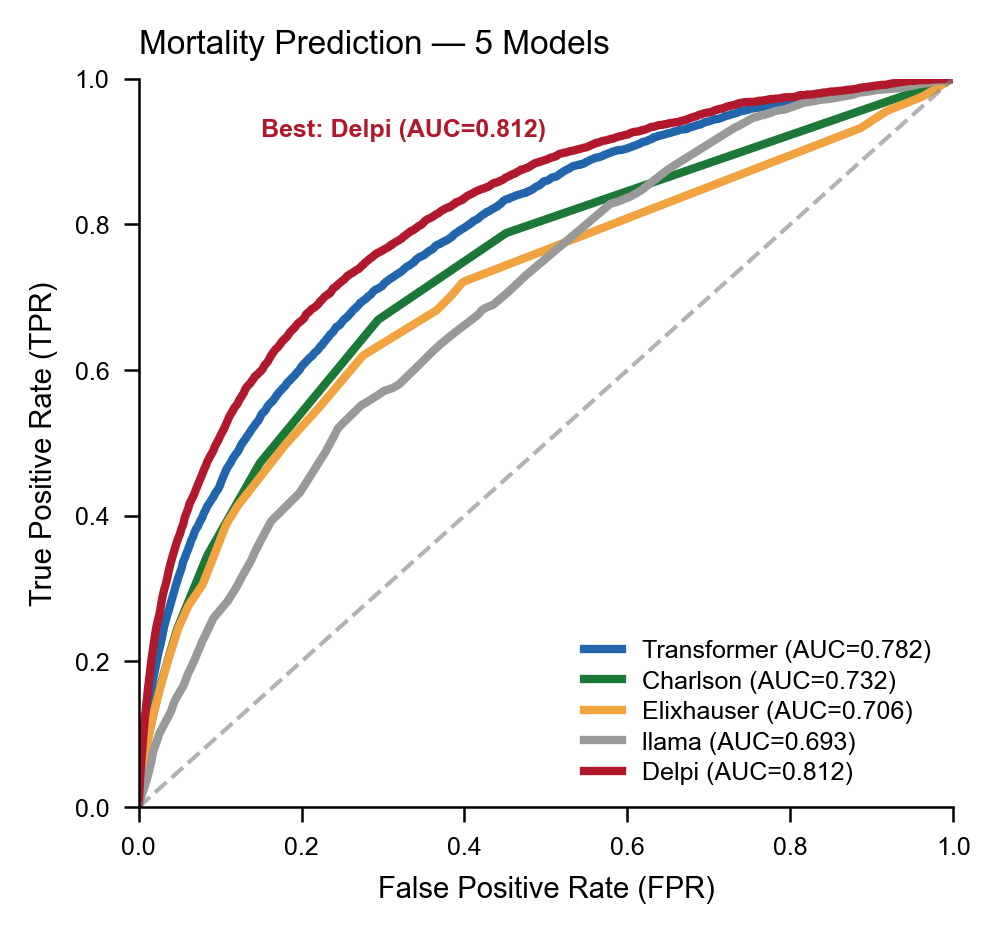
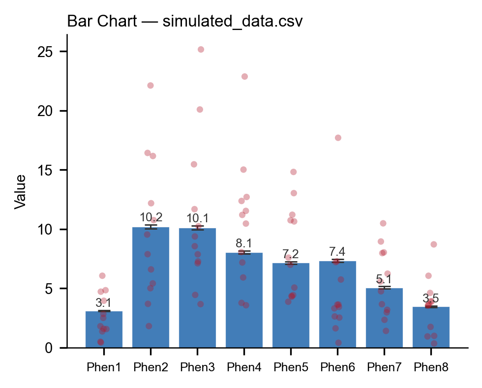
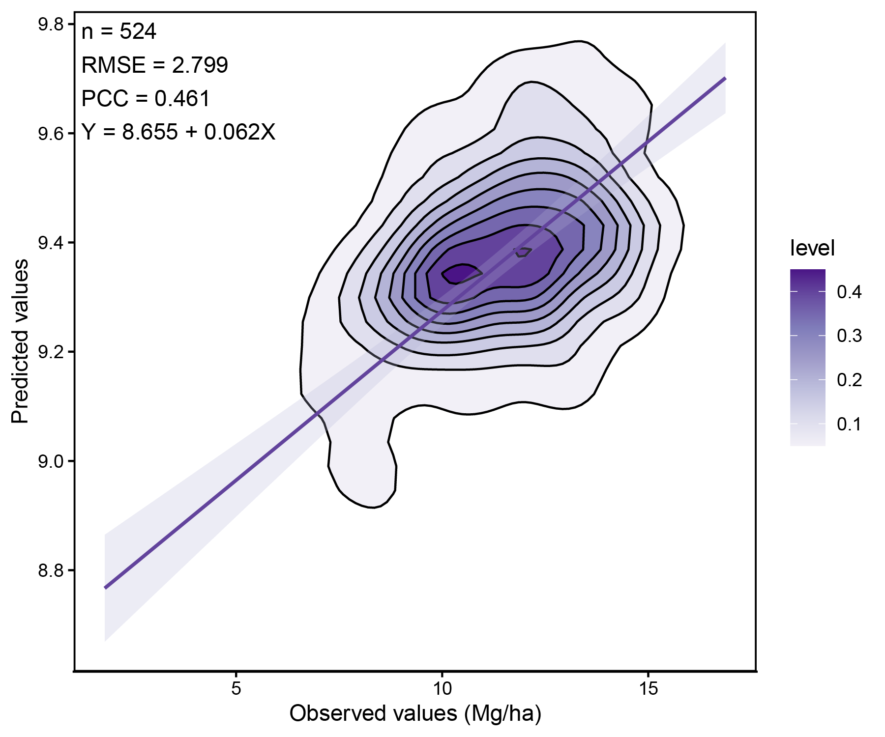
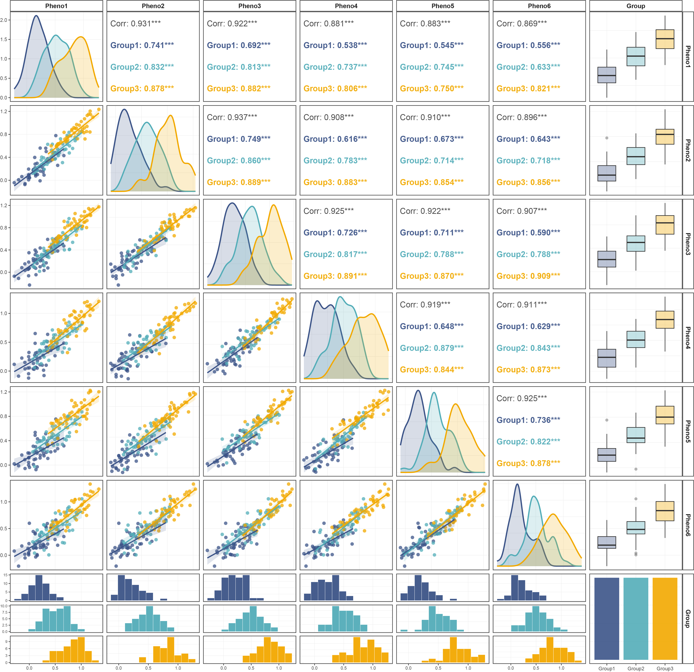
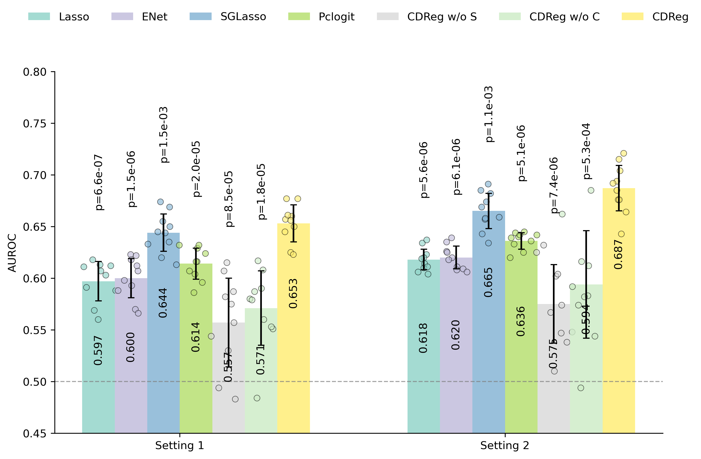
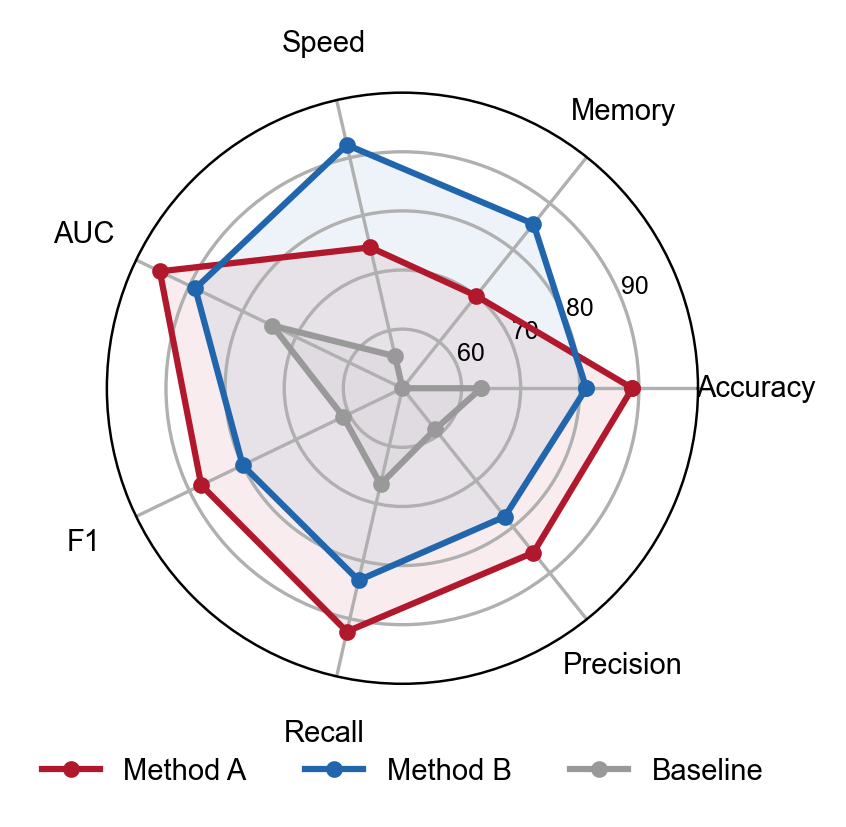
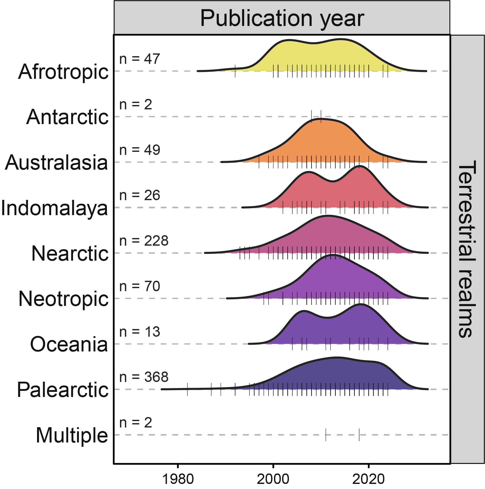
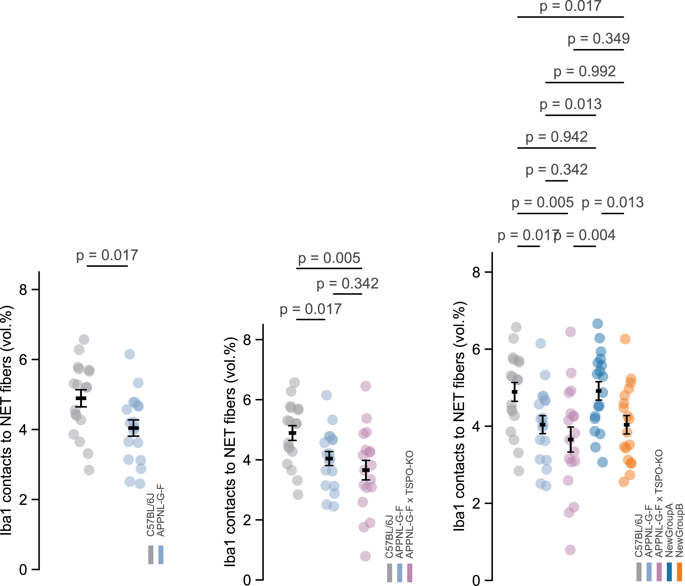
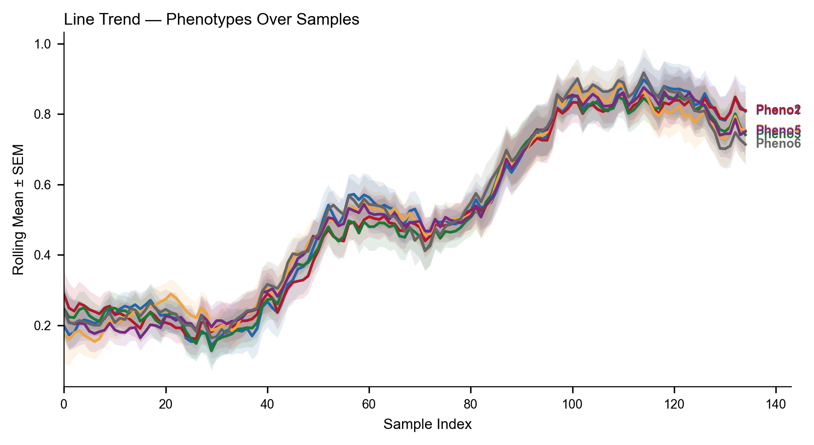
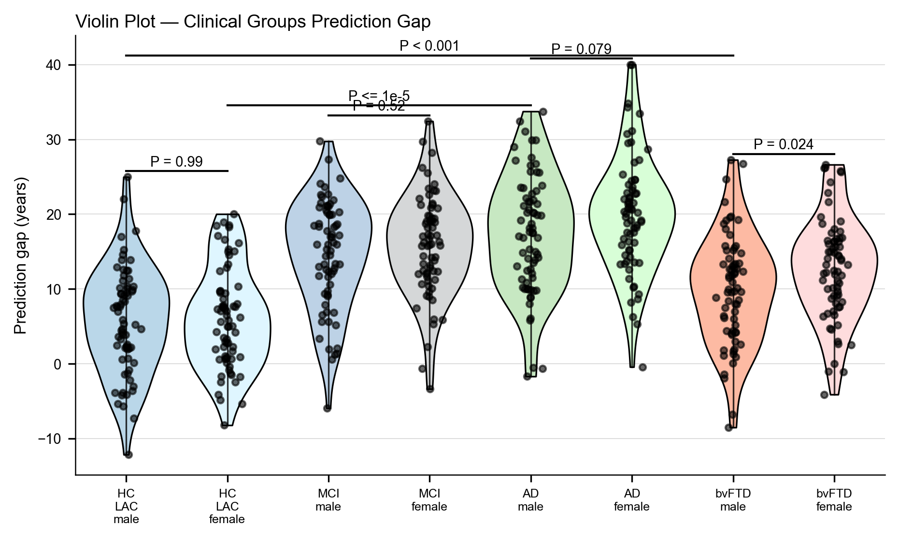

<div align="center">
  <h1>Academic Figure Skill</h1>
  <p><strong>面向学术级科学图表生成Skill，可自动完成从数据解读到顶刊格式图表生成的全流程。</strong></p>
  <p>
    问题驱动 · 8 步闭环工作流 · 29 种图型 · 四轮 QA 协议 · 矢量 PDF 交付 · 统计报告
  </p>
  <p>
    <a href="LICENSE"></a>
    <a href="#安装与使用"></a>
    <a href="#图表类型全览"></a>
    <a href="#assets-figure-atlas"></a>
    <a href="README_EN.md"></a>
  </p>
  <p>
    <a href="#项目介绍">项目介绍</a>
    · <a href="#安装与使用">安装与使用</a>
    · <a href="#图表类型全览">图表类型</a>
    · <a href="#系统工作流">工作流</a>
    · <a href="#项目结构">项目结构</a>
    · <a href="#质量评估与测试">质量评估</a>
    · <a href="#贡献指南">贡献指南</a>
    · <a href="README_EN.md">English</a>
  </p>
</div>

---

**Academic Figure Skill** 以"问题驱动而非模板驱动"为核心原则——每一张图从科学问题出发，通过 8 步闭环工作流（用户意图解析 → 原型分类 → 图型论证 → 环境探测 → 风格注入 → 资产检索 → 渲染生成 → 质量验证），输出可直接投稿的矢量 PDF 主文件 + 300dpi PNG 预览 + 统计报告。更多详情，请关注微信公众号：**科研绘图酱**。

---

## 效果预览

<p align="center">
  
</p>

<details>
<summary>点击展开更多示例图表</summary>
<p align="center">
  
</p>
</details>

---

## 项目介绍

Academic Figure Skill 是一个面向 AI 编程助手（Claude Code、Codex 等）的 Skill 包。其工作方式是：将 Nature / Cell / Science 系列期刊的图表制作规范（字体 Arial/Helvetica、栏宽 89mm/183mm、PDF 矢量导出、300dpi 栅格预览）和 29 种常见图型的视觉参数编码为 `SKILL.md` 及其引用的 16 份参考文档。当用户提供数据和科学问题后，Skill 引导 LLM 执行一个标准化的 8 步流程：澄清研究问题 → 分类图型原型 → 论证面板方案并获取用户确认 → 检测 Python/R 运行时 → 注入统一的排版和配色基线 → 扫描 `assets/figures/` 中的生产脚本（匹配则原生运行，无匹配则跨类型继承视觉参数）→ 数据校验 → 4 轮 QA 自检 → 输出矢量 PDF 与统计报告。

该 Skill 不替代 Python 或 R 的绘图能力，而是提供一套结构化的约束条件（constraints）和先验知识（priors），使 LLM 在生成绘图代码时遵循 CNS 期刊的视觉标准，减少人工调整排版、配色和导出参数的工作量。在多面板合成场景中，Skill 支持 Python 脚本和 R 脚本的混合编排——R 面板通过 Cairo 设备渲染为位图，Python 的 `compose.py` 排版引擎按物理尺寸拼合多面板。

### 设计原则

| 原则 | 说明 |
|------|------|
| **一幅图一个核心信息** | 审稿人 3 秒扫读即懂；移除网格线、边框和无用图例 |
| **克制配色 > 丰富配色** | 2-4 个语义主色 + 1 个强调色；禁用 matplotlib/ggplot 默认色板 |
| **面向印刷设计** | 期刊固定栏宽（单栏 89mm / 双栏 183mm），创建时即设定尺寸，不再缩放 |
| **矢量优先** | 线图/散点/柱状 → PDF/SVG；只有真正的栅格内容（热图色块/显微图）才用 ≥300dpi TIFF/PNG |

---

## 核心能力

| 能力 | 说明 |
|------|------|
| **原型分类** | 四类范式：`quantitative_grid`（定量网格）、`schematic-led`（示意引导）、`image plate + quant`（图像-定量融合）、`asymmetric_mixed`（非对称复合）——自动驱动布局与英雄面板策略 |
| **29 种图型** | 热图 / 火山图 / 柱状图 / 散点图 / 箱线图 / PCA / RDA / 雷达图 / 桑基图 / AUROC / 山脊图 / 小提琴图 / 边际密度 / 核密度 / Mantel 相关 / UpSet / 森林图 / 混淆矩阵 / 流形 / 堆叠柱散 / 配对箱线 / 标记基因点图 / 趋势线 / 3D 热图 / 频率热图 / 密度热图 / 相关矩阵 / 分组相关矩阵 / 分组小提琴——每种均有配套生产脚本（`.py` + `.R`）与预览 PNG |
| **Copy-First 规则** | 生成代码前扫描 `assets/figures/<type>/`，匹配到生产脚本则**原生运行**——Python 跑 `.py`，R 跑 `.R`，不翻译、不降级质量 |
| **跨类型参数继承** | 无生产脚本时，从相近图型借用 Class A（硬参数：颜色/透明度/线宽）、Class B（比例参数：字号/尺寸）、Class C（逻辑参数：图例开关/网格开关）三类视觉参数 |
| **混合语言组合** | R 面板原生运行 → 输出 spec-correct PNG，Python 排版引擎按精确物理尺寸拼合多面板 |
| **英雄面板自动识别** | 承载核心结论的面板自动获得更大的视觉权重，支撑面板居次排列 |
| **四轮 QA 协议** | Pass 0：反模式扫描（AP-0-7）→ Pass 1：代码级合规（CL-1-7）→ Pass 2：视觉逻辑与数据完整性（VI-1-6）→ Pass 3：渲染输出验证（VV-1-5），共 30+ 项检查 |
| **数据校验门禁** | 逐面板预检——火山图需 ≥10 个显著差异基因、AUROC 曲线分离需 ≥0.15、热图须有跨行方差——不通过则拒绝渲染 |
| **统计与可复现报告** | 每张图强制附带：n 定义、中心统计量（均值/中位数）、散布度量（SD/SEM/95%CI）、检验名称、多重比较校正、source-data 溯源 |
| **期刊配色系统** | Nature 偏冷蓝、Cell 偏暖、Science 偏保守灰；色盲友好，避免红绿独对区分 |
| **审稿人模拟模式** | 从五个维度审视成品——科学清晰度、视觉层次、配色可访问性、排版可读性、整体完成度——给出 must-fix vs. suggestion 分级反馈 |

---

## 私有资产图表类型全览

> 图鉴中展示的示例图表基于项目私有数据资产生成，仅作为风格参考。用户请求生成同类型图表时，脚本在保留示例所确立的视觉语言（配色、字体、布局逻辑、图元层级）的前提下，依据实际数据完成适配性重构。私有资产持续更新中。更多详情，请关注微信公众号：科研绘图酱

| 图表名称 | 预览 | 图形特征 | 典型应用场景 |
|---------|------|---------|-------------|
| 3D 热图 |  | 立体柱面矩阵数值，高度+颜色双重编码 | 多因子交互效应、基因型×环境矩阵、三维强度分布 |
| AUROC 曲线图 |  | TPR-FPR 曲线，含对角参考线与 AUC 标注 | 分类模型评估、多模型 ROC 对比、阈值敏感性分析 |
| 柱状图 |  | 单变量条形高度编码，支持误差棒 | 组间均值比较、单指标排序、计数统计 |
| 相关性密度图 |  | 散点叠加二维核密度等高线 | 两变量关系强弱、密集区识别、异常点检测 |
| 相关性矩阵图 |  | 方形网格，色阶+数值双重展示成对相关系数 | 多变量相关性总览、特征筛选前共线性检查 |
| 密度热图 |  | 连续二维核密度颜色梯度铺满网格 | 大样本点云密度分布、替代过度重叠散点图 |
| 频率 3D 热图 |  | 立体柱面展示分箱频次 | 等位基因频率分布、双因子计数交叉展示 |
| 分组相关性矩阵图 |  | 按分组拆分的多个相关矩阵并列呈现 | 不同处理/环境下相关结构差异比较 |
| 分组柱状图 |  | 同一类别下并列多个子组条形 | 多处理×多指标对比、重复实验组间差异 |
| Mantel 相关性检验图 |  | 相关矩阵热图叠加连线标注 r 值与显著性 | 环境因子与群落/基因型矩阵关联、距离矩阵分析 |
| PCA 主成分分析图 |  | 样本投影至 PC 平面，附椭圆置信区间 | 群体结构分析、样本聚类趋势、降维可视化 |
| 雷达图 |  | 多轴放射排列，闭合多边形综合表现 | 多指标品种/模型综合评估、性状剖面对比 |
| 山脊图 |  | 多组密度曲线纵向错落叠放 | 多组/多时间点分布形态对比、性状分布趋势 |
| 桑基图 |  | 节点间流量宽度编码，多阶段流转 | 通路/流程转化路径、类别间流动归因分解 |
| 堆叠柱状散点复合图 |  | 堆叠柱体+叠加散点标注个体数值 | 组成结构展示同时保留原始样本点 |
| 趋势图 |  | 折线随连续变量走势，可含置信带 | 性状随环境梯度变化、时间序列走势 |
| 小提琴图 |  | 镜像密度轮廓呈现分布形状 | 组间分布形态与离散程度比较、非正态数据展示 |

---

## 系统工作流

```text
┌─────────────────────────────────────────────────────────────┐
│  User Intent Parsing / 用户意图解析                           │
└─────────────────────────────────────────────────────────────┘
  Step -1  需求澄清    │ 逆向提问锚定分析目标："这份数据要回答什么问题？"
  Step 0a  原型识别    │ 四类范式判定：定量网格 / 示意引导 / 图像-定量融合 / 非对称复合
  Step 0b  数据解析    │ 问题驱动的结构化解析，拒绝模板化套用
  Step 1   图型论证    │ 循证式选型：N 个面板对应 N 个独立科学问题
  Step 2   环境探测    │ 运行时自检（Python / R 内核、依赖完整性）
  Step 3   风格注入    │ 视觉基线固化：字体系统 + 配色方案 + 导出规格
  Step 4   资产检索    │ 扫描 assets/figures/<type>/，逐面板匹配已有生产脚本
  Step 5   渲染生成    │ Copy-First 原生运行或跨类型参数继承
  Step 5.5 数据校验    │ 逐面板预判图表可用性，不通过则拒绝渲染
  Step 6   质量验证    │ 四轮 QA 协议，30+ 项检查点
  Step 7   成果交付    │ 矢量 PDF + 300dpi PNG + 统计报告 + QA 报告
```

**核心原则**：问题驱动而非模板驱动——图型选择基于科学问题的数量与结构，视觉风格通过资产库进行继承而非从零构建。

---

## 安装与使用

`academic-figure-skill` 是一个以 `SKILL.md` 为核心的 Skill 包。完整安装需保留 `references/`、`scripts/`、`assets/`、`install/` 等目录，Skill 依赖这些文件完成视觉基线注入、资产检索和跨平台适配。

### Claude Code

如果尚未安装 Claude Code：

```bash
npm install -g @anthropic-ai/claude-code
claude
```

克隆仓库到稳定路径并安装 Skill：

```bash
mkdir -p ~/ai-skills
cd ~/ai-skills
git clone https://github.com/TingxiYu/academic-figure-skill.git
cp -r academic-figure-skill ~/.claude/skills/
```

安装后在 Claude Code 会话中直接描述需求即可自动触发：

```text
请使用 academic-figure-skill 分析项目文件中的multip-traits.csv数据，并进行可视化分析。
```

```text
用academic-figure-skill将data.csv数据绘制为一个 Nature 风格的差异表达火山图。
```

如需更新：

```bash
cd ~/ai-skills/academic-figure-skill
git pull
cp -r . ~/.claude/skills/academic-figure-skill/
```

### Codex

Codex 支持通过 `install/codex/` 中的 `manifest.yaml` + `instructions.md` 加载 Skill。将以下目录复制到 `~/.codex/skills/academic-figure-skill/`：

```bash
git clone https://github.com/TingxiYu/academic-figure-skill.git
cd academic-figure-skill
mkdir -p ~/.codex/skills/academic-figure-skill
cp -r SKILL.md references/ scripts/ assets/ install/codex/* ~/.codex/skills/academic-figure-skill/
```

安装后在 Codex 会话中自然描述需求，Skill 会根据 `manifest.yaml` 中的触发规则自动激活。

也可以让 Codex 代为安装：

```text
从 https://github.com/TingxiYu/academic-figure-skill.git 安装 Codex skill。
克隆仓库后，将 SKILL.md、references/、scripts/、assets/ 和 install/codex/ 复制到 ~/.codex/skills/academic-figure-skill/。
保持完整目录结构，不要只复制 SKILL.md。
```

### Cursor

将 Skill 规则文件复制到项目根目录，Cursor 在生成代码时会自动遵循其中的规范：

```bash
git clone https://github.com/TingxiYu/academic-figure-skill.git
cp academic-figure-skill/install/cursor/.cursorrules <your-project>/.cursorrules
```

`.cursorrules` 包含了配色方案、排版基线、导出规格等核心规则。如需更新规则，重新执行上述复制命令即可。

### GitHub Copilot

将 Skill 指令文件复制到项目的 `.github/` 目录，Copilot 在生成代码时会加载这些上下文：

```bash
git clone https://github.com/TingxiYu/academic-figure-skill.git
mkdir -p <your-project>/.github
cp academic-figure-skill/install/copilot/copilot-instructions.md <your-project>/.github/
```

如果已有 `.github/copilot-instructions.md`，建议将本 Skill 的内容追加到文件末尾。

### 其他 Agent

对于其他 AI 编程助手：

1. 保持仓库的稳定克隆副本
2. 创建一个轻量级的 subagent、slash command 或自定义 prompt wrapper，指向 `SKILL.md`
3. 确保 `references/`、`scripts/`、`assets/` 等目录与 `SKILL.md` 保持在同一相对路径下
4. 如果 Agent 有特殊的格式要求，可基于 `SKILL.md` 调整 frontmatter 和 body 结构

---

## 项目结构

```text
	academic-figure-skill/                          ← 核心 Skill 包（本目录）
    ├── README.md                      ← 项目说明文档（本文件）
    ├── LICENSE                        ← MIT 许可证
    ├── SKILL.md                       ← 技能入口：8 步闭环工作流 + 全部规则
    ├── references/                    ← 16 份共享知识文档
    │   ├── figure-contract.md         ← 图表合同：核心结论 + 证据链 + 审稿风险
    │   ├── color-palettes.md          ← 配色系统：分类/发散/连续 + 色盲友好
    │   ├── typography.md              ← 字体规范：Arial/Helvetica, ≥5pt 底限
    │   ├── journal-specs.md           ← 期刊尺寸：单栏 89mm / 双栏 183mm
    │   ├── export-specs.md            ← 导出规格：PDF/SVG 矢量 + 300dpi PNG
    │   ├── multipanel-layout.md       ← 多面板排版：反冗余 + 英雄面板 + 叙事顺序
    │   ├── directory-map.md           ← 图型目录映射：中英文关键词 → 资产路径
    │   ├── checklist.md               ← 完整 QA 检查清单
    │   ├── common-pitfalls.md         ← 常见陷阱与解决方案
    │   ├── revision-cases.md          ← 审稿修改案例库
    │   ├── journal-intel.md           ← 各期刊特有情报
    │   ├── figure-deconstruction.md   ← 图表解构：构图灵感参考
    │   ├── matplotlib.md              ← Python/matplotlib/seaborn 指南
    │   ├── complexheatmap.md          ← R ComplexHeatmap 指南
    │   ├── r-rendering.md             ← R PNG 渲染规范（cairo 设备）
    │   └── compose.R                  ← R 排版参考实现
    ├── scripts/                       ← 编译引擎 + QA 工具 + 评估套件
    │   ├── compose.py                 ← 多面板排版引擎
    │   ├── eval_runner.py             ← 全量资产审计（29 类型自动扫描）
    │   ├── trigger_benchmark.py       ← 触发准确率基准测试
    │   ├── qa_coverage.py             ← QA 检查覆盖度验证
    │   ├── qa_validator.py            ← 代码自动检查（AP-0~CL-7）
    │   ├── check_references.py        ← 引用完整性校验
    │   ├── e2e_runner.py              ← E2E 集成测试（A/B 场景自动评分）
    │   ├── check_colors.py            ← 配色合规检查
    │   ├── check_dimensions.py        ← 尺寸规范检查
    │   ├── check_export.py            ← 导出参数检查
    │   ├── check_fontsize.py          ← 字号合规检查
    │   ├── check_figure.py            ← 图表综合检查
    │   ├── generate_adapters.py       ← 跨平台适配文件生成
    │   ├── generate_atlas.py          ← 图鉴自动生成
    │   └── run_ab_tests.py            ← A/B 测试运行器
    ├── assets/
    │   ├── figures/                   ← 29+ 种图型生产脚本与预览
    │   │   ├── 3DHeatmap/             ← 3D 热图（R/ComplexHeatmap）
    │   │   ├── AUROC/                 ← AUROC 曲线
    │   │   ├── BarAblation/           ← 消融实验柱状图
    │   │   ├── BarCategorical/        ← 分类柱状图
    │   │   ├── BarComparison/         ← 模型对比柱状图
    │   │   ├── BarComposition/        ← 组成柱状图
    │   │   ├── BarDistribution/       ← 分布柱状图
    │   │   ├── ConfusionMatrix/       ← 混淆矩阵
    │   │   ├── CorrelationMatrix/     ← 相关性矩阵（ggpairs）
    │   │   ├── DensityHeatmap/        ← 密度热图
    │   │   ├── Frequency_3DHeatmap/   ← 频率 3D 热图
    │   │   ├── GroupedBarChart/       ← 分组柱状图
    │   │   ├── GroupedCorrelationMatrix/ ← 分组相关矩阵
    │   │   ├── GroupedViolin/         ← 分组小提琴图
    │   │   ├── KernelDensity/         ← 核密度估计
    │   │   ├── LineTrend/             ← 趋势折线图
    │   │   ├── Manifold/              ← 流形可视化
    │   │   ├── MantelCorrelation/     ← Mantel 相关性检验
    │   │   ├── MarginalDensity/       ← 边际密度图
    │   │   ├── MarkerGeneDotPlot/     ← 标记基因点图
    │   │   ├── PCA/                   ← PCA 主成分分析
    │   │   ├── PairedBoxScatter/      ← 配对箱线散点图
    │   │   ├── Radar/                 ← 雷达图
    │   │   ├── RidgePlot/             ← 山脊密度图
    │   │   ├── SankeyDiagram/         ← 桑基流图
    │   │   ├── StackedBarScatter/     ← 堆叠柱状散点复合图
    │   │   ├── Violin/                ← 小提琴图
    │   │   ├── heatmap/               ← 聚类热图
    │   │   ├── volcano/               ← 火山图
    │   │   ├── basic-plots/           ← 基础图型
    │   │   ├── multipanel/            ← 多面板模板
    │   │   └── other/                 ← 长尾图型
    │   └── figure-atlas/              ← 图鉴预览 PNG 合集
    └── install/                       ← 跨平台适配
        ├── claude-code/               ← Claude Code（原生支持，开箱即用）
        ├── cursor/                    ← Cursor IDE 适配
        ├── copilot/                   ← GitHub Copilot 适配
        └── codex/                     ← Codex CLI 适配
```

---

## 质量评估与测试

### QA 四级协议

| 轮次 | 名称 | 检查项数 | 说明 |
|------|------|---------|------|
| Pass 0 | 反模式扫描 (AP) | 8 | 默认色板、四边边框、图例内置、截图导出、jet 色条、无散点柱状图、默认字体、大样本未栅格化 |
| Pass 1 | 代码合规 (CL) | 7 | 排版基线、配色方案、导出规格、资产确认表、无降采样、图表尺寸、期刊规范 |
| Pass 2 | 视觉逻辑 (VI) | 6 | 数据范围、热图方差、相关性强度、PCA 分离度、分布形态、数据丢失透明度 |
| Pass 3 | 渲染验证 (VV) | 5 | PDF 生成、PNG 生成、非零文件、字体嵌入、尺寸正确 |

### 运行评估

```bash
# 全量资产评估
python scripts/eval_runner.py

# 单类型评估
python scripts/eval_runner.py --type Heatmap

# E2E 集成测试
python scripts/e2e_runner.py

# 触发准确率基准
python scripts/trigger_benchmark.py
```

---

## 贡献指南

Academic Figure Skill 采用 Skill 插件架构，添加新图型只需：

1. 在 `assets/figures/` 下创建新目录 `<FigureType>/`
2. 放入生产脚本（`.py` 或 `.R`）和预览 PNG
3. 在 `references/directory-map.md` 中添加关键词映射
4. 运行 `python scripts/eval_runner.py --type <FigureType>` 验证通过

---

## 许可证

[Apache 2.0](LICENSE) © 2025 Academic Figure Skill
